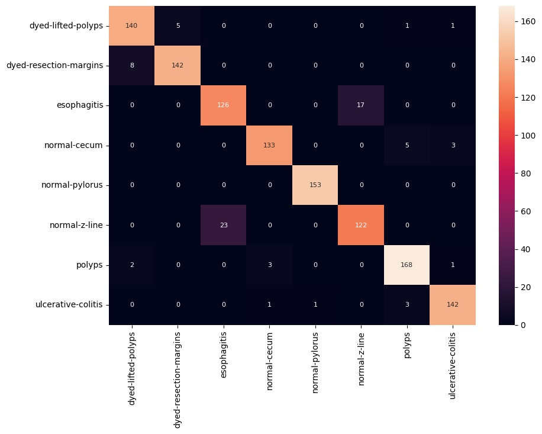

# Tutorial 2: Training a Transformers Classifier model from HuggingFace

This part of the tutorial shows how you can train and save a transformers model from the HuggingFace platform.

## VisionClassifierTrainer Object

The `VisionClassifierTrainer` class contains the functions needed to train the transformer model taken from the HuggingFace platform.

**Note:** The previous steps for loading the dataset need to be already done.

### Choose a image classifier model on HuggingFace

Now we can choose our base model on which we will perform a fine-tuning to make it fit our needs.

Our choices aren't very large since we haven't a lot of model available yet on HuggingFace for this task.

So, to be sure that the model will be compatible with `HugsVision` we need to have a model exported in `PyTorch` and compatible with the `image-classification` task obviously.

Models available with this criterion can be found [here](https://huggingface.co/models?filter=pytorch&pipeline_tag=image-classification&sort=downloads)

At the time I'am writing this, I recommend to use the following models:

* `google/vit-base-patch16-224-in21k`
* `google/vit-base-patch16-224`
* `facebook/deit-base-distilled-patch16-224`
* `microsoft/beit-base-patch16-224`

**Note:** Please specify `ignore_mismatched_sizes=True` for both `model` and `feature_extractor` if you aren't using the following model.

```python
huggingface_model = 'google/vit-base-patch16-224-in21k'
```

### Train the model

So, once the model choosen, we can start building the `Trainer` and start the fine-tuning.

**Note**: Import the `FeatureExtractor` and `ForImageClassification` according to your previous choice.

```python
from hugsvision.nnet.VisionClassifierTrainer import VisionClassifierTrainer
from transformers import ViTFeatureExtractor, ViTForImageClassification

trainer = VisionClassifierTrainer(
    model_name   = "MyKvasirV2Model",
    train        = train,
    test         = test,
    output_dir   = "./out/",
    max_epochs   = 1,
    batch_size   = 32, # On RTX 2080 Ti
    lr           = 2e-5,
    fp16         = True,
    model = ViTForImageClassification.from_pretrained(
        huggingface_model,
        num_labels = len(label2id),
        label2id   = label2id,
        id2label   = id2label
    ),
    feature_extractor = ViTFeatureExtractor.from_pretrained(
    huggingface_model,
    ),
)
```

### Evaluate F1-Score

Using the F1-Score metrics will allow us to get a better representation of predictions for all the labels and find out if their are any anomalies wit ha specific label.

```python
hyp, ref = trainer.evaluate_f1_score()
```

__Output:__

```plain
                        precision    recall  f1-score   support

    dyed-lifted-polyps       0.93      0.95      0.94       147
dyed-resection-margins       0.97      0.95      0.96       150
           esophagitis       0.85      0.88      0.86       143
          normal-cecum       0.97      0.94      0.96       141
        normal-pylorus       0.99      1.00      1.00       153
         normal-z-line       0.88      0.84      0.86       145
                polyps       0.95      0.97      0.96       174
    ulcerative-colitis       0.97      0.97      0.97       147

              accuracy                           0.94      1200
             macro avg       0.94      0.94      0.94      1200
          weighted avg       0.94      0.94      0.94      1200
```

__Confusion Matrix:__



## Resources

The best way of understanding how its works is to refer to the different recipes available in the `recipes` directory.

## Next documentation

You can now take a look at:
* [TUTORIAL_5_INFERENCE](TUTORIAL_5_INFERENCE.md)
